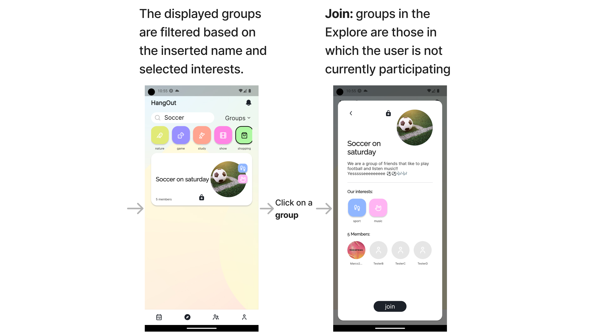

# HangOut :iphone:
[](https://codecov.io/gh/MarcoBendinelli/HangOutApp)

HangOut is a modern mobile app that revolutionizes socializing. It offers a seamless user experience with four main pages: _My events_, _Explore_, _My groups_, and _Profile_. Users can discover events and groups based on specific interests, manage their activities, and personalize their account. HangOut also includes interactive pop-ups for viewing detailed information, accessing user profiles, creating events and groups, and managing notifications.


The application, developed by me and [Matteo](https://github.com/Beltrante), follows a **CI/CD** process thanks to Github actions and is currently available [here](https://play.google.com/store/apps/details?id=com.bendinelli.beltrante.hang_out_app). Elisa, an exceptional designer, contributes to the UI/UX. Explore her amazing work on her website [here](http://elisaciliberti.it/).

## Design Document

Check out the [Design Document](/design_document/HO_Design_Document.pdf) to learn more! This document includes (mainly) the following information:

* Key features of HangOut, including unified sign-in options, group and event exploration, creation and customization of groups and events, efficient organization, flexible modifications, chat functionality, profile and app settings management, and unified notifications management
* Use Cases illustrating various scenarios and interactions users may have with the application
* Wireframes providing visual representations of the app's interface design for both phone and tablet devices
* The hierarchy and flow of navigation
* Supported platforms
* Technologies and frameworks used in the development
* The high-level system architecture, component interaction, and design patterns utilized in the app
* Database services used
* The third-party APIs integrated
* Details strategies employed to optimize the performance
* Testing: the unit, widget, and integration testing process
* How code branches are organized
* Continuous integration and continuous deployment process.

## Phone Navigation Graph

<p align="center">
  
</p>

## Phone Screens

<p align="center">
  
</p>

<p align="center">
  
</p>

<p align="center">
  
</p>

<p align="center">
  
</p>

<p align="center">
  
</p>

<p align="center">
  
</p>

<p align="center">
  
</p>

<p align="center">
  
</p>

<p align="center">
  
</p>

<p align="center">
  
</p>

<p align="center">
  
</p>

## Tablet Screens

<p align="center">
  
</p>

<p align="center">
  
</p>

<p align="center">
  
</p>

<p align="center">
  
</p>

<p align="center">
  
</p>

<p align="center">
  
</p>

<p align="center">
  
</p>

## Test Coverage

<p align="center">
  
</p>

## Additional Information

### Firebase Config
* code/android/app : your google-services.json
* code/lib : your firebase_options.dart
* code/ios : your firebase_app_id_file.json
* code/ios : your GoogleService-Info.plist
* code/ios/Runner/Info.plist : your keys in the ```m4rc0``` section

### Run Integration Tests:

* ```firebase emulators:start```
* ```flutter test integration_test/app_test.dart```
* or to all in one with screenshots
* ```firebase emulators:exec "flutter drive --driver=test_driver/integration_test.dart --target=integration_test/app_test.dart"```

### For CI
* Create ```key.properties``` and ```key.jks``` following the Flutter guide and put them in a ```key_files``` folder
* Zip it to ```key_files.zip```, encrypt it with ```gpg --symmetric --cipher-algo AES256 key_files.zip```, and insert a password to be used later
* Put encrypted file in the Android folder and save the password in ```secrets.ANDROID_KEYS_SECRET_PASSPHRASE```
